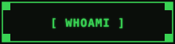

<div align="center">


<br/>

<br/>
**B.Tech Computer Engineering Student**

Backend Developer &nbsp;•&nbsp; MERN Stack &nbsp;•&nbsp; Java &nbsp;•&nbsp; DSA


<br/>

[](mailto:omhire11092007@gmail.com)
[](https://www.linkedin.com/in/om-hire-658321373/)
[](#)

</div>

<br/>

<div align="center">


<br/><br/>

[](#whoami)
[](#educationlog)
[](#projectsexe)
[](#techstack)
[](#experiencelog)
[](#achievementslog)
[](#currentfocus)

</div>

<br/>

## WHOAMI

`[ WHOAMI.LOG ]`

```
> user      : om2007
> name      : Om Hire
> role      : B.Tech Computer Engineering Student
> location  : Dhule, Maharashtra, India
```

I am Om Hire, currently pursuing a B.Tech in Computer Engineering at SVKM's NMIMS, Dhule. Before this, I completed a Diploma in Computer Engineering with 93.47%, First Class with Distinction.

My primary interest is backend development, alongside full-stack work with the MERN stack, Java, C++, and Data Structures & Algorithms. I've worked on real-world projects — the Krishivishwa Biotech Website and the Extension Activity Monitoring System for KVK Dhule — mainly as a backend developer, while also contributing to frontend integration.

I'm working toward growing into a strong Software Engineer, with a current focus on strengthening my problem-solving and backend fundamentals.

<div align="right">

[↑ Back to Directory](#system-directory)

</div>

<br/>
